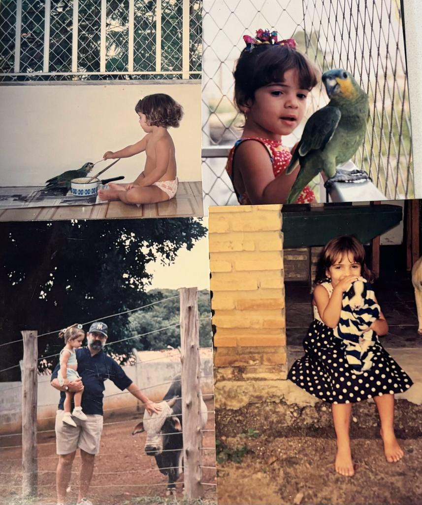
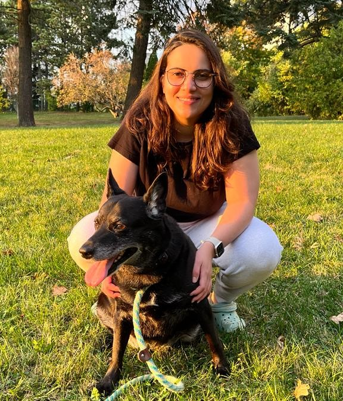

# About Clara

I've always been passionate about animals, and I lived around them since I was a child. I had or used to interact with dogs, cats, cows, horses, birds, fishes, hamsters, rabbits, and even a goat named Little Louis (Luizinho in Portuguese).

When I was 5 I used to ask my grandpa to take me to see a cow called Mel. I loved to pet her and touch her soft skin. My grandpa used to say I'll be a veterinarian when I grow up. I didn't become a veterinarian, but I'm still passionate about animals. I'm the person who plays with the dog at the party instead of talking to people.

I have a dog named Lola. She was rescued from the streets in Brazil by a friend of mine who found her and her siblings in a box. She was 45 days old when I adopted her. We don't know her breed, and I don't care about it. 
When we moved to Canada, we brought her with us. She loved the cold weather and the park in front of our home. She's very happy here, and this is the most important thing for me. She is my soul dog <3

## Why me?

- ⁠Have solid experiente as a developer and frontend
- ⁠Have experience as lead of tech teams
- Details oriented
- Fast learner
- Ability to plan and execute
- Experience training other devs
- Educational qualification
- ⁠Knowledge about data analysis and business strategy

I'm available any time to discuss the project and my experience in more detail. Feel free to contact me.

[Link to my Resume](/Resume_Clara.pdf)

## References

These are some people that I worked with and can give you more information about me. Feel free to contact them.

1. **Verivaldo Lobo - CEO and Founder at Cubos Tecnologia**

   [LinkedIn](https://www.linkedin.com/in/verivaldo-lobo-3103549b) | [E-mail](mailto:verivaldo@cubos.io) | [Phone](tel:+55119956762377)

   [Recommendation Letter](/Recommendation_Letter_Verivaldo.pdf)

2. **Rodrigo Araujo - CTO at InHire**

   [LinkedIn](https://www.linkedin.com/in/dygufa/) | [E-mail](mailto:dygufa@gmail.com) | [Phone](tel:+557198859-9772)

   [Recommendation Letter](/Recommendation_Letter_Rodrigo.pdf)

3. **Thais Alonso - Head of B2B & Partnerships at Cubos Academy**

   [LinkedIn](https://www.linkedin.com/in/thaisfalonso) | [E-mail](mailto:thais.alonso@cubos.academy) | [Phone](tel:+5571981464991)

4. **Lucas Magalhães - Head of Technology at Cubos Academy**

   [LinkedIn](https://www.linkedin.com/in/lucasmagalhaes/) | [E-mail](mailto:lucasmagalhaesas@gmail.com) | [Phone](tel:+16074142592)
