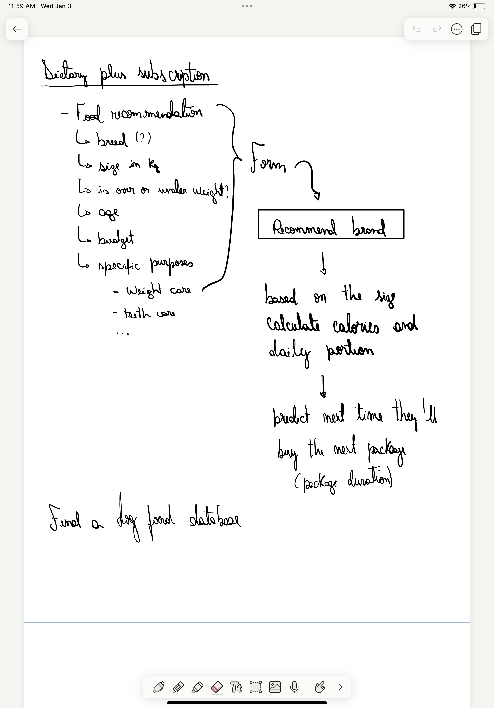
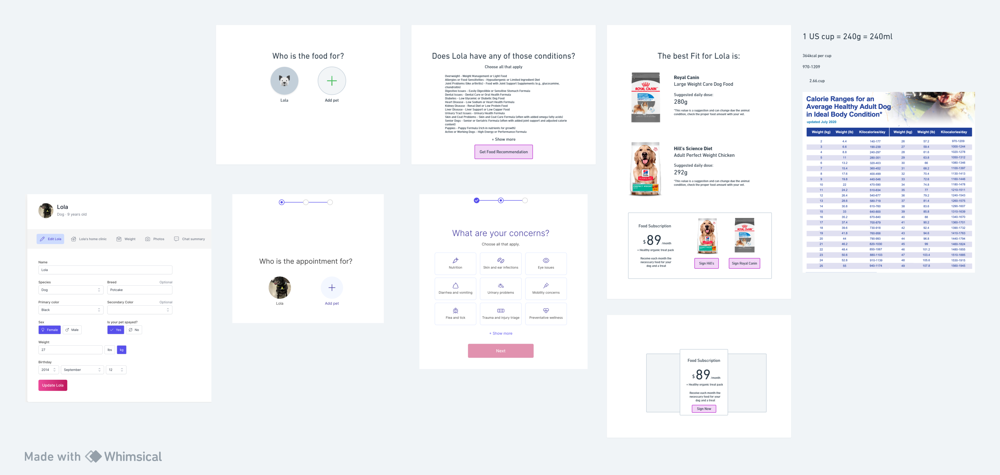
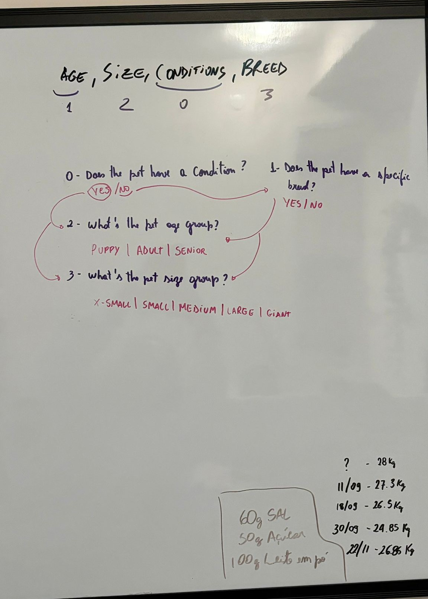
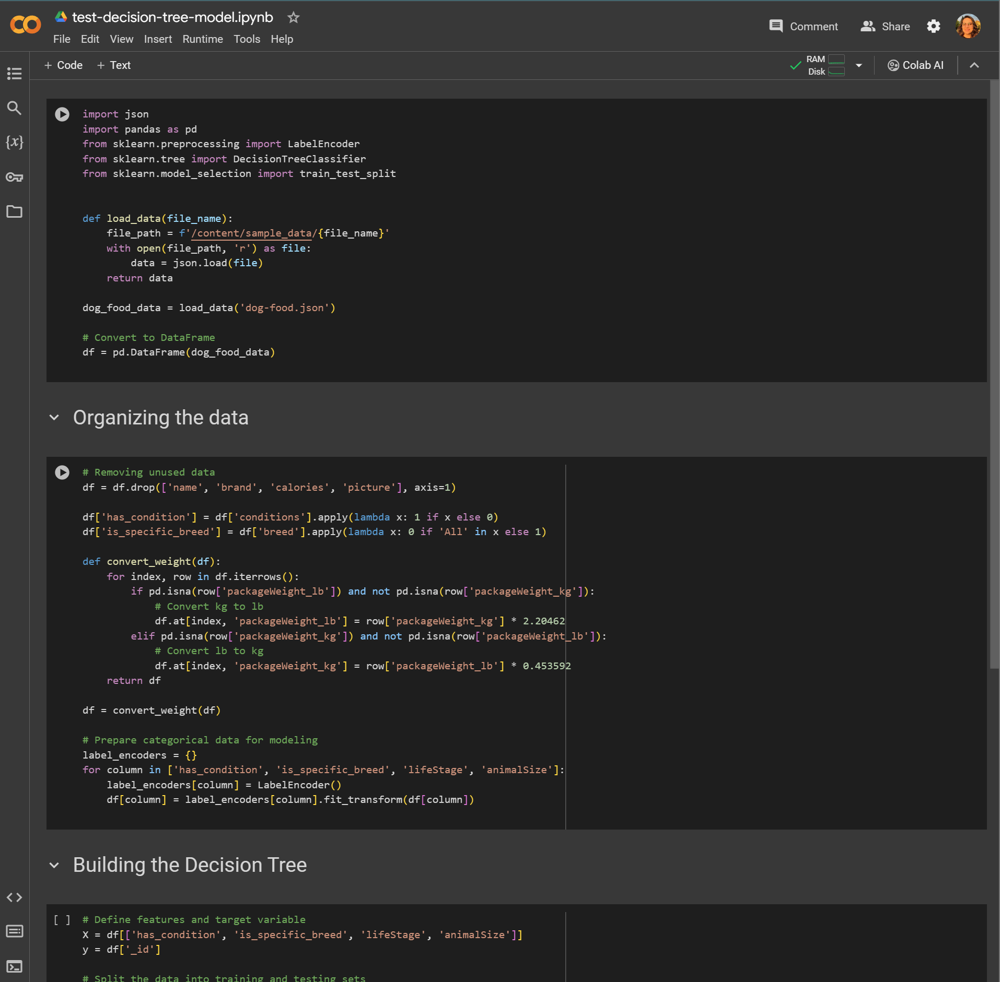

# Creative process

## The idea

Once I had the idea of this challenge, I started to think about what kind of features a pet owner would like to have at Vetster's website. I've started to think about my own experience as a pet owner and what was difficult and Vetster could help me with. Once I have the idea of something related with food, I draw some sketches on iPad, I love to make ideas visible, I always use my whiteboard, presentations, paper, anything that I can express and organize what I'm thinking on.



## Research

When I realized that the feature would be related to food, I started to research about Vetster's platform and what kind of information they have about pets and the technologies they use in the website platform inspecing the website code.

As I had a base knowledge of how animal feed process works, because I studied for Lola's new diet, I didn't need to research much about it. I just needed to get some support materials like a [table of calories per food type/brand](https://www.franklinanimalclinic.vet/sites/site-2382/documents/Dog_Dry_Foods1.pdf) and a list of health conditions that could be used in the feature.

## Design

I started to design the flow in Whimsical, a tool that I love to use to design flows and wireframes because of its simplicity (I can focus on what matters and not in make it beautiful). I've designed the flow and the wireframes for the feature. I used Vetsert's website prints to guide me in the design process, as I wanted to keep the same style and colors.



## Development

### Frontend

I started making the project structure, installing the dependencies and setting up the project. I've used Vue3, Vue Router, Vite, Pinia, VitePress, TailwindCSS, Heroicons and Firebase Hosting, you can check more details in the [Technology Stack](/project-scope.md#technology-stack) section.

With a defined project structure, I could start working on the general layout, the sidebar, main menu, and the area where the routes would be rendered. I wanted to keep it as real as possible in term of working process, so I used a github repository to keep track of the project, commiting and pushing the code as I was working on it. [You can check the project's commit history here](https://github.com/clarabatt/pet-food-advice/commits/main/). Even creating workflows to deploy my application on Firebase and using branchs and pull requests to control and organize the code I was producing.

I realized that I had to cut some scope and focus on a kind of pet as MVP. Do I decided to focus on dogs, and not delivering login, signup, and pet creation features.

The next phase was to create the feature UI itself, at least for the first parts of the flow, the pet selection and the health conditions selection. I've created the components and the routes for these two parts, and also the global state management with Pinia, which I was pretty happy with, it's a tool very close to MobX in React, which I love to use because it keep things simple. By the way, I loved to use Vue3. I'm thinking about using it in my next projects, instead of React.

### Data and Decision Tree

I've started to work on the logic of the feature, the decision tree. I've created a JSON file with the dog food samples:

```json
{
  "_id": "001",
  "name": "Royal Canin® Breed Health Nutrition® Golden Retriever Puppy Dry Dog Food",
  "brand": "Royal Canin",
  "conditions": [],
  "packageWeight_kg": 13.6,
  "packageWeight_lb": null,
  "price": 122.99,
  "calories": {
    "perCup": 674,
    "perKg": 890
  },
  "breed": ["Golden Retriever"],
  "animalSize": "All",
  "lifeStage": "Puppy",
  "picture": "https://s7d2.scene7.com/is/image/PetSmart/5184508?$CLEARjpg$"
}
```

I got those samples from [PetSmart's website](https://www.petsmart.ca/dog/food/dry-food/authority+blue-buffalo+hills-science-diet+natural-balance+nutrience+purina-pro-plan+royal-canin/?pmin=0.01&srule=best-sellers), and made some adjusts for my use. Thank you, PetSmart <3.

The decision tree was a part that requires some tests. I draw the questions in my white board to think how I could organize the priority order.



_\* That in the right corner bottom is Lola's weight track._

Once with an idea of how the decision tree would work, I started to code it. I decided to use python as it has a lot of libraries to help with data manipulation and trees. I've used pandas to manipulate the data and sklearn to create the decision model. I've created a Colab Notebook to test the model and the data manipulation before using it in an API.

[You can check the notebook here](https://colab.research.google.com/drive/1iEG3p1saytlS0wGL7Upbh8W7b5FDvt1t?usp=sharing)


