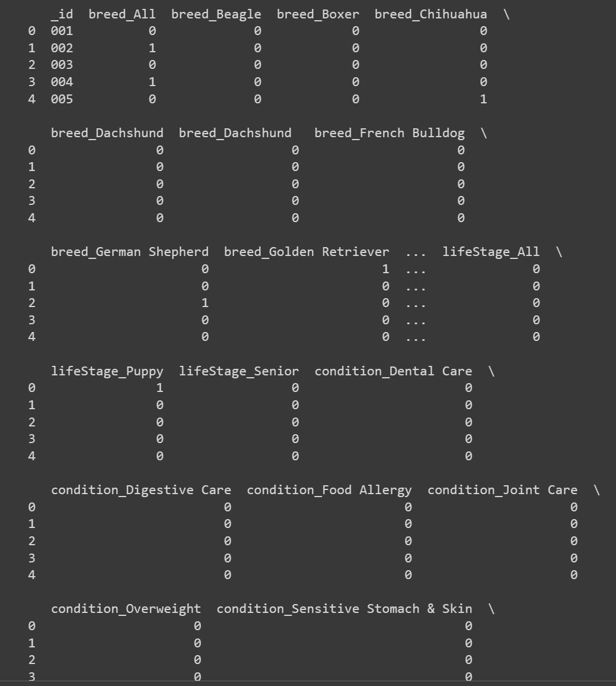

# Feature Enhancements

**Every project can be improved.** As technology professionals, we need to know the time to stop because, in the business world, we are ruled by the project trio: scope, cost and time. This section shows some ideas to improve or place this feature in a real production environment.

## Frontend

1. **Click anywhere out the sidebar to close it.** As well when changing the route. It's a much better user experience.

2. **Control the form steps using the URL.** Besides, it's a simple feature. I prefer to use the router to control the steps for dense forms because it's easier to share the URL with someone, navigate using the browser arrows, or go to any desired page.

3. **Save the already recommended products on the database.** It's a good idea to avoid recommending different products, as that could confuse the user. Also, in a real scenario, the user would go back to this feature to check what was recommended before instead of making the flow again.

4. **Use veterinarians to improve the recommendation.** We can develop a feature for the veterinarians to approve or disapprove the recommendation made for the specific pet. This information won't be shown to the user, but we can use that data to improve the recommendation.

5. **Store the user data in the localStorage.** Default approach in a real scenario after authenticating the user. The `userStore` must search user data in the localStorage before going to a sign-in/sign-up route and proceeding with the API call for each case.

6. **Error component to show a message when the API is down.**

7. **Calculate the recommended food amount.** The API can return the recommended amount of food for the pet based on the weight of food characteristics as calories.

8. **Give tips about dividing the food amount throughout the day.** The front end can show a screen with different arrangements of food portions. For example, if the recommended amount is 100g, the user can divide it into two meals of 50g or three meals of 33g. Another tip we can show is to use a scale to measure the food amount at the beginning of the day and put it in a container to avoid over or under-feeding the pet.

## Backend

1. **Use a real database solution to store the data.** I suggest a NoSQL database because the food objects can change and gain different attributes over time, as it's not a core feature and managing a relational database would consume a lot of time.

2. **Move the endpoint for an existing API.** The solution can stay in a serverless solution. As proof of concept, it achieved the goal, but we can put it inside the existing API project. Maintaining the same codebase, authentication, and deployment process is better.

3. **Change the dataset to use brands and products that Vetster wants to work with.**

4. **Use types to improve API reliability.**

5. **Use a solution to store the encoded data to avoid processing it every time the API is called.**

   > Encoded data is a table organized differently, where the columns are the attributes and the rows are the products. In this data frame, we have only `0` and `1`, where `0` means that the product doesn't have the attribute and `1` means that the product has the attribute. We only need to encode the data when the dataset changes.

   
