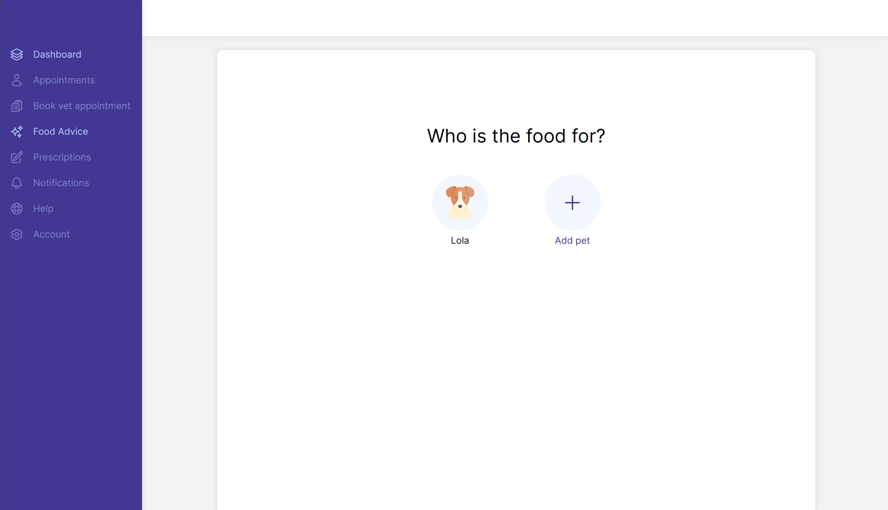
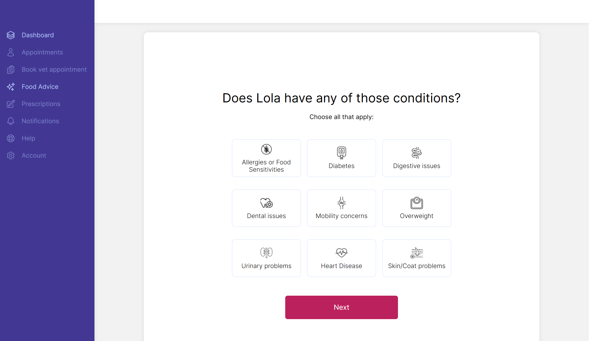
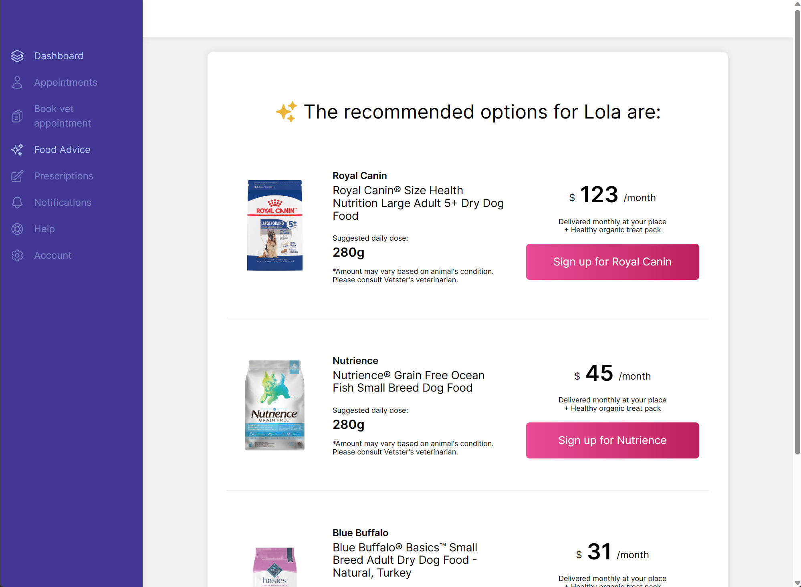

# Project Scope

This is a project to emulate a possible feature of Vetster's website, **the Pet Food Advisor**. It's a simple feature to helps pet owners to choose the best food for their pets.

## Why this feature?

As a pet owner, I know that the food I give to my dog is very important for her health, it's directly related to her quality of life. Recently, I got into two situations that made me change Lola's food brand. The first one was when we moved to Canada, since the food brand she used to eat in Brazil is not available here. The second one was when the veterinarian told me she was overweight and I had to change her food to a low calorie one. Moreover, it was difficult to understand how many calories she should eat per day, and how much food I should give her.

As a platform, Vetster has two main audiences: pet owners and veterinarians. I chose to focus on the first, as I know some of their needs are similar to mine.

The Pet Food Advisor feature would help parents to choose the best food for their pets and give them the possibility to buy it directly from Vetster's website through a subscription plan. More importantly, available brands would be recommended and trusted by Vetster's veterinarians. It copuld also help pet owners to understand how much food they should give to their pets, based on the animal's caracteristics, like age, weight, breed and health conditions.

## Business Impact

If this feature would be implemented in Vetster's website, **I believe it would interfere in the three main Business KPIs: Net Promoter Score (NPS), Customer Satisfaction (CSAT) and Revenue.**
I don't believe this feature would have a direct impact in the number of consultations or new customers, but it would help to increase the number of returning customers and their frenquency, as it opens up the opportunity for cross-selling, engaging users that already trust the brand and the veterinarians.

### Net Promoter Score (NPS) and Customer Satisfaction (CSAT)

NPS is a metric used to measure customer loyalty, while CSAT is used to measure customer satisfaction. Both are important metrics to measure the customer experience and the company's reputation.

I believe this feature would help to increase the NPS and CSAT, as it would help pet owners to trust the brand and the veterinarians more, elevating the company's reputation and the times that the customers come back to the platform or see the Vetster's brand whenever the food is delivered in their houses.

### Revenue

Cash flow is one of the most important aspects of a business. This feature would help to increase the amount of recurrent revenue, through the subscription plan, and also the amount of revenue per customer.

There are two ways to implement the operation of this feature: Vetster could have a partnership with a petstore company, or they could sell the food directly to the customers. In both cases, Vetster would make a margin.

An important aspect of this operation is to keep the stock as short as possible, even if pet's food is not a product that expires quickly, but it's a product that takes a lot of space and specific storage conditions. So a partnership with a pet food company would be the best option.

::: info
As I don't have access to Vetster's data, or any kind of business information, this is only an assumption based on my experience as a pet owner and my knowledge as a software engineer and Program Manager.
:::

## Technology Stack

### Frontend

I chose Vue3 as it's the technology used in Vetster web product. As I always had curiosity to learn it, this was a great opportunity to check out this technology. I followed the Vue guidelines and used other Vue ecosystem tools as Vue Router, Vite, Pinia, VitePress to keep project consistency.

For styling, Vetster's website uses Tailwind UI, which provides pre-built components, but it is a paid tool.
I installed TailwindCSS, but ended up not using it. I've worked many years with Bootstrap, which have the same Tailwind's concept (style trhough css pre-built classes), and I believe it can lead to a verbose code, so I prefered to use SASS for styling.

- Vue3: Frontend Framework
- Vue Router: Routing
- Vite: Build Tool
- Pinia: Global State Management
- VitePress: Documentation
- TailwindCSS: Styling
- Heroicons: Icons
- Firebase: Hosting

::: info
I've tried to follow Vetster's website guidelines as data patterns, colors, fonts, icons and images.

As they use Tailwind UI, I've tried my best to mimic the components without spending too much time on it, as the goal of this project is to show the feature itself and not the basic website components copy. Despite believing a good UI is important to the UX, I've made it as good as possible given the restrictions.
:::

### Backend

- Python
- Azure Functions

I chose Python as my backend language for two reasons. First, I wanted to work with some Data Science or Machine Learning tools in this project, and **Python is the most used language in this area with several libraries available.** Second, I've worked with Python for data purposes in my last experience, so it's a familiar technology.

I detailed more about the algorithm in the [Data and Recommendation Algorithm](/ideation-process.md#data-and-recommendation-algorithm) section.

Azure Functions was my choice to deploy the backend code for three reasons:

- It's a simple and fast way to deploy Python code.
- I'm studying for Azure certifications and want to practice it more.
- My API is simple, with only one endpoint, so I didn't need a more complex solution.

As a database solution, I used a simple JSON file. It's not an option for a real production application, but it was enough to show the feature working.
